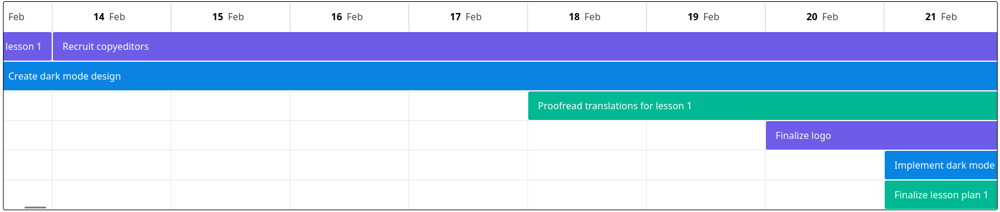
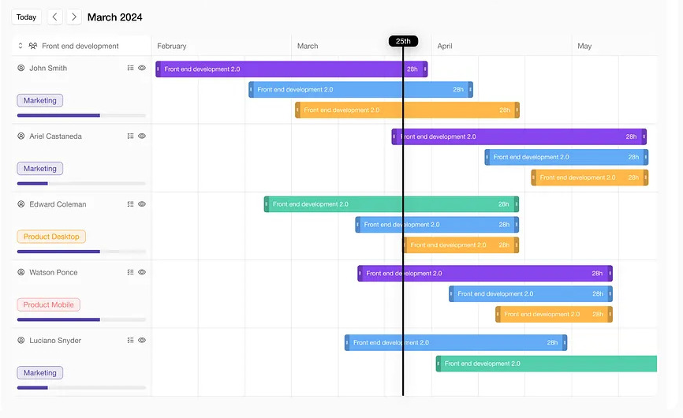
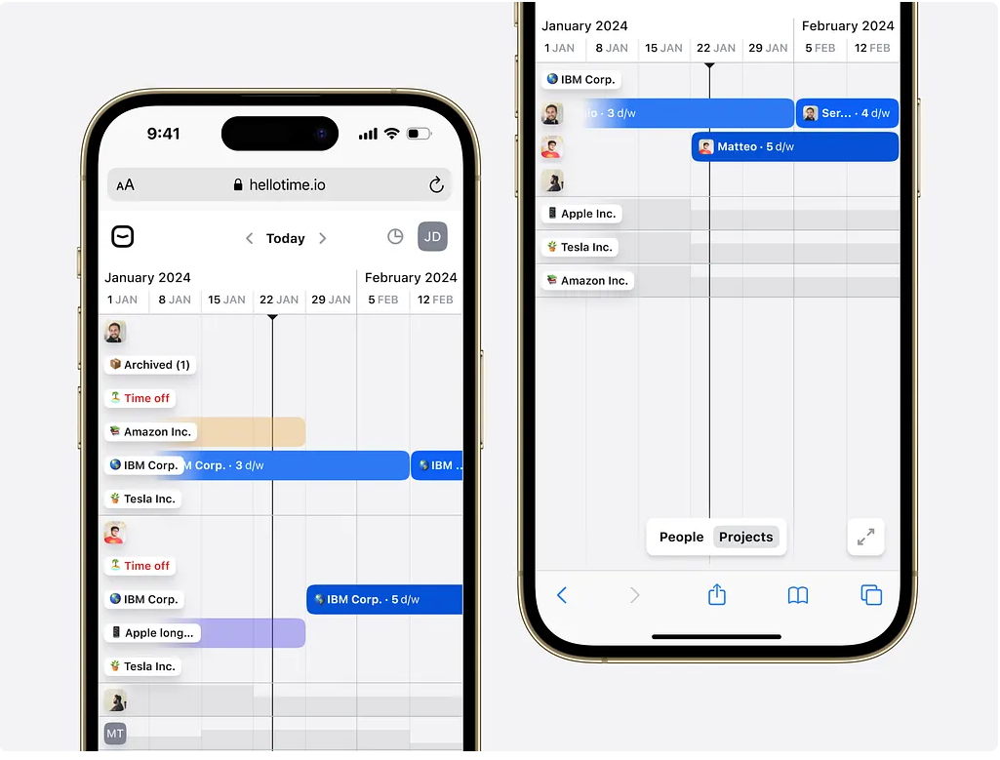

# Timeline implementation

Read the intructions [HERE](./instructions.md)

## Final result

## Plan
First, I searched for a timeline at Dribbble. Found [this](https://dribbble.com/shots/24713025-SaaS-Gantt-Timeline-View) good example for desktop:

And [this](https://dribbble.com/shots/24110039-Schedule-people-and-projects-from-a-timeline) example for mobile:

### Timeline structure

After having the main idea for the design I thought of my making a horizontal timeline with columns being date intervals. Starting with days then weeks and ending with months intervals. These intervals should be set defined by a "zoom" applied to the timeline. Also, we get a vertical line that represents the day.

The rows should be filled by timeline items. Ideally, if no item overlap, there should be only one single row with items next to each other. So for each item overlap, there should be an addition of another row. The main logic was already provided by the starting code in `src/assignLanes.js`. Having those rows/lanes, we render each on individually and for each row we render their items.

Then I thought about the timeline item. Since we initially have only a name, a simple "tag" design should work. The width of the item should represent the interval. We can also add the duration of the item (eg.: 4 days). Later we can think about a custom component.

## Starting the project
Thinking about the tools to use, the first thing I thought was using libraries like Tailwind for helping with design. But since I wanted full control over my components, I decided to do it by hand.

### Timeline
So first I did the timeline structure. The header of the timeline was a Date array made from the interval of the min date of the timeline items and today. I fixed the column size so we could have everything done by multiplication.

### Lanes
Then, I made my lanes, they are the size of my timeline. For each lane, I render their items. Each item has a starting point from the offset of the min date to the date they start. The Item width equals the interval of starting and ending date.

## Result
I like the project since it is a timeline itself. I believe I can make it better if I hadn't lost time trying to make the grid in a better way, since it is a bunch of divs with absolute position.

Started doing the "zoom" functionality but didn't have enough time to finish it. The zoom would basically change the interval value of my columns.

### Testing
To test this, I would first make unit tests to ensure the math is done right with the intervals, assuring that depending on date values, I can always get the size of an Item correctly.

Then I could test for the text shown itself, where I could certify that depending on the scroll, I can always get the date column I want and the Item name.

There should also have tests for the correct lanes assignment and for the correct Item rendering

## Final considerations
Unfortunately, I ended up wasting a lot of my time creating the grid of my timeline, which could be done way faster. The same time could be used to `- Allow editing the name of items inline`. Dragging and droping could be done easily with an external library like `react-rnd`. Also, there should be a line indicating the current date that is being hovered by the mouse.

After all, I liked the assignment and I'm probably going to improve it and create a library out of it.
